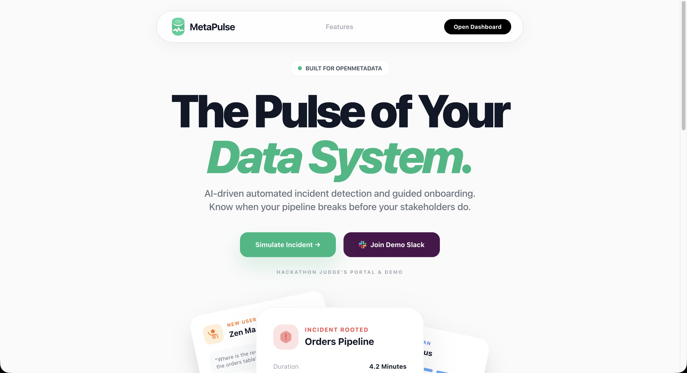

# MetaPulse — Know When Your Data Breaks

> AI-powered data incident responder and onboarding 
> copilot built on OpenMetadata + Claude AI



## What is MetaPulse?

MetaPulse is an AI-powered observability layer for 
OpenMetadata. It solves two critical problems for 
data teams:

**Incident Responder** — When a pipeline breaks or 
a data quality test fails, MetaPulse automatically:
- Detects the failure via OpenMetadata webhook
- Traces full lineage to find all downstream assets
- Identifies every affected asset owner
- Generates a structured AI incident report via Claude
- Posts a formatted alert to Slack in under 10 seconds

**Onboarding Copilot** — When a new engineer joins, 
they chat with MetaPulse and get:
- A personalised tour of the most relevant data assets
- Lineage context showing how assets connect
- Real owner information pulled live from OpenMetadata
- Answers to follow-up questions with full catalog context

## Demo
🎥 Demo video: https://youtu.be/rrnvNoRuoD8
🔴 Live demo: https://metapulse-tau.vercel.app

## Tech Stack

- **Frontend:** Next.js 14, TypeScript, Tailwind CSS
- **Backend:** Next.js API Routes, Node.js
- **AI:** Anthropic Claude API (claude-sonnet-4-20250514)
- **Data Platform:** OpenMetadata 1.4.1 REST APIs
- **Notifications:** Slack Webhook API
- **Infrastructure:** Docker, Vercel

## OpenMetadata APIs Used

| API | Purpose |
|-----|---------|
| `/search/query` | Discover relevant assets by role |
| `/lineage/{entity}/{id}` | Trace downstream impact |
| `/tables/{id}` | Get table details and owners |
| `/dataQuality/testCases` | Detect quality failures |
| `/teams` | Find team members |
| `/users` | Get asset owners |

## Architecture

OpenMetadata Webhook
→ /api/webhook (Next.js)
→ Core Agent (lib/agent.ts)
→ OpenMetadata APIs (lib/openmetadata.ts)
→ Claude AI (lib/claude.ts)
→ Slack Notification (lib/notify.ts)
→ Incident Report (Dashboard UI)

User Chat
→ /api/chat (Next.js)
→ Onboarding Agent (lib/agent.ts)
→ OpenMetadata Search + Lineage APIs
→ Claude AI (lib/claude.ts)
→ Chat Response (Dashboard UI)

## Running Locally

### Prerequisites
- Node.js 18+
- Docker Desktop
- OpenMetadata instance
- Anthropic API key
- Slack webhook URL

### Setup

1. Clone the repository:
```bash
git clone https://github.com/Lazy-Code-X01/metapulse
cd metapulse
```

2. Install dependencies:
```bash
npm install
```

3. Start OpenMetadata via Docker:
```bash
curl -sL https://github.com/open-metadata/OpenMetadata/releases/download/1.4.1-release/docker-compose.yml -o docker-compose.yml
docker compose up -d
```

4. Create `.env.local`:
```bash
OPENMETADATA_BASE_URL=http://localhost:8585/api/v1
OPENMETADATA_PAT=your_personal_access_token
ANTHROPIC_API_KEY=your_anthropic_api_key
SLACK_WEBHOOK_URL=your_slack_webhook_url
```

5. Run the development server:
```bash
npm run dev
```

6. Open [http://localhost:3000](http://localhost:3000)

### Seed Sample Data

```bash
npm run seed
```

This creates sample tables (orders, customers, 
payments, products) in OpenMetadata for testing.

## Hackathon Track

**WeMakeDevs x OpenMetadata Hackathon 2026**

- **Primary Track: T-01 — MCP & AI Agents**
  MetaPulse is an AI agent that interacts with 
  OpenMetadata's APIs to automate incident response 
  and guide data catalog onboarding through 
  natural language.

- **Secondary Track: T-02 — Data Observability**
  MetaPulse monitors pipeline health, detects data 
  quality failures, and traces downstream impact 
  across the metadata graph in real time.

## AI Disclosure

As required by hackathon rules:
- GitHub Copilot used for development assistance
- Anthropic Claude API powers incident report 
  generation and onboarding responses
- All architecture, integration logic, and product 
  decisions made by the developer

## License

MIT
